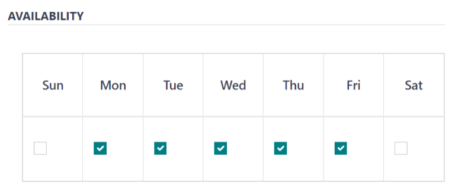

=======
Vendors
=======

Before :doc:`products can be added <products>` to the *Lunch* app, the restaurants that provide the
food, referred to as *vendors* in Odoo, **must** be configured.

To add a new vendor, first navigate to :menuselection:`Lunch app --> Configuration: Vendors`, and
all currently configured vendors for the *Lunch* app appear in a default Kanban view. To change to a
list view, click the :icon:`oi-view-list` :guilabel:`(view list)` icon in the top-right corner.

.. note::
   No vendors are preconfigured in the *Lunch* app, so all vendors **must** be added to the
   database.

To add a new vendor, click the :guilabel:`New` button in the top-left corner, and a new lunch
supplier form loads.

Fill out the following fields on the form.

Vendor information
==================

- :guilabel:`Vendor`: enter a name for the vendor.
- :guilabel:`Vendor`: select the vendor from the drop-down menu. If the vendor has not already been
  entered in the system, type in the vendor name and click either :guilabel:`Create "vendor"` to add
  them, or :guilabel:`Create and edit...` to create the vendor and edit the vendor form. The vendor
  form allows for more detail, aside from the name, to be entered, such as contact information.

  .. note::
     If a selection is made to the drop-down :guilabel:`Vendor` field, the text :guilabel:`Vendor`
     field (above the drop-down :guilabel:`Vendor` field) updates with the name of the vendor chosen
     from the drop-down menu.

     The list of vendors that is presented in the drop-down menu is pulled from the *Contacts*
     application.

- :guilabel:`Address`: enter the vendor's address in the various fields in this section.
- :guilabel:`Email`: enter the vendor's email in this field.
- :guilabel:`Phone`: enter the vendor's phone number in this field.
- :guilabel:`Company`: if this vendor is only available to a specific company, select the company
  from the drop-down menu. If this field is left blank, the vendor's items are available to **all**
  companies.

.. image:: vendors/vendor-info.png
   :align: center
   :alt: The top portion of the vendor form filled out.

.. _lunch/availability:

Availability
============

The :guilabel:`AVAILABILITY` section presents a table with two rows. The days of the week populate
the top row, and the bottom row has checkboxes. Tick the corresponding checkbox for each day of the
week the vendor is available.

By default, Monday through Friday are ticked.

Orders
======

The *Orders* section of the vendor form details which locations the vendor is available for, and how
and when orders are placed and received.

- :guilabel:`Delivery`: using the drop-down menu, select either :guilabel:`Delivery` if the vendor
  delivers to the office, or :guilabel:`No Delivery` if orders must be picked up.
- :guilabel:`Location`: select which locations are able to order from this vendor. Multiple
  locations can be selected. If this field is left blank, **all** locations can order from the
  vendor.

  .. note::
     By default, an `HQ Office` location is created by default when creating a database, and is
     available to select from the list.

- :guilabel:`Send Order By`: click the radio button to select how orders are sent to the vendor. The
  available options are :guilabel:`Phone` or :guilabel:`Email`.
- :guilabel:`Order Time`: this field **only** appears if :guilabel:`Email` is selected for
  :guilabel:`Send Order By`. Enter the time that an order must be emailed for the order to be
  accepted. Enter the time in a `HH:MM` format, then select either :guilabel:`AM` or :guilabel:`PM`
  from the drop-down next to the time field.

.. image:: vendors/orders.png
   :align: center
   :alt: The orders section of a vendor form, with all fields filled out.

.. _lunch/extras:

Extras
======

When ordering an item in the *Lunch* app, it is possible to show extra items that can be added to an
order, sometimes referred to as *add-ons*. These can be configured in any manner that suits the
products being offered.

By default, Odoo allows for three types of extra items, which can be thought of as *categories*. By
default, the first type or *category* of add-ons is labeled `Extras`, the second is labeled
`Beverages`, and the third is labeled `Extra Label 3`.

.. important::
   When configuring the extras, it is important to keep in mind that all the extras configured will
   appear for **every item** offered by the vendor. That means that only items which apply to
   **all** products from the vendor should be added.

.. _lunch/configure-extras:

Configure extras
----------------

Enter the following information for each of the three available extra sections:

- :guilabel:`Extra (#) Label`: enter a name for the type of extra, such as `Toppings` or
  `Beverages`. This can be thought of as a *category*.
- :guilabel:`Extra (#) Quantity`: select how the extras are selected. The options are:

  - :guilabel:`None or More`: select this if the user is not required to make a selection.
  - :guilabel:`One or More`: select this to **require** the user to make **at least one** selection.
  - :guilabel:`Only One`: select this to **require** the user to **make only one** selection.

Add extras
----------

After the labels and quantities have been configured for an extra category, the individual extra
items must be added for each category.

Click :guilabel:`Add a line` at the bottom of the list that appears on the right-hand side of the
extra category. Enter the :guilabel:`Name` and :guilabel:`Price` for each item being added. The
price can remain at `$0.00` if there is no cost. This is common for items like disposable silverware
or condiments.

.. example::
   For a pizzeria that only offers personal pies, see their extras configured as follows:

   The first extra is configured for the various toppings they offer. The :guilabel:`Extra 1 Label`
   is set to `Toppings`, and the :guilabel:`Extra 1 Quantity` is set to :guilabel:`None or More`.
   The various toppings are then added, with their corresponding costs.

   .. image:: vendors/extras.png
      :align: center
      :alt: The first of the extras configured for pizza toppings.

   The pizzeria also offers a free beverage with any purchase. To set this up, the :guilabel:`Extra
   2 Label` is set to `Beverages`, and the :guilabel:`Extra 1 Quantity` is set to :guilabel:`Only
   One`. The various beverage choices are added, and the cost for each remains zero.

   .. image:: vendors/beverages.png
      :align: center
      :alt: The second of the extras configured for a free beverage with purchase.
