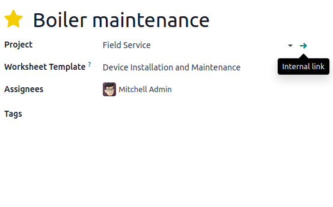

==========
Worksheets
==========

**Worksheets** help your field service workers perform and report their on-site tasks. They can
feature various information, such as instructions, to-do lists, etc. You can also format your
worksheet using checkboxes, bullet points, blank fields to fill in, HTML, and add files, images,
links, and more.

It is common for businesses to have their workers perform the same type of field service
repeatedly. Making custom **worksheet templates** eliminates the need to recreate the same
worksheet each time you plan a similar field service task.

Configuration
=============

To use worksheets in Field Service, go to :menuselection:`Field Service --> Configuration -->
Settings`, enable the :guilabel:` Worksheets` feature, and click :guilabel:`Save`.

.. warning::
   Worksheet templates are designed using **Studio** and clicking :guilabel:`Design Template`
   automatically installs the **Studio** app, which impacts your price plan.

Create a worksheet template
---------------------------

To create your **worksheet templates**, go to :menuselection:`Field Service --> Configuration -->
Worksheet Templates`. Click :guilabel:`New` and give your worksheet template a name. You can also
add a company and a color to add clarity if needed and manually :guilabel:`Save`. Then click
:guilabel:`Design Template` to open **Studio** and customize your worksheet template.

In Studio click :guilabel:`Add`. Drag and drop the items that you want from the left column
into your worksheet. To rearrange the items, just drag and drop them in the order that you want.
Click on the items you added to your worksheet to customize their properties.

When your Worksheet Template is complete, click :guilabel:`Close` in the top right corner of the
page to leave **Studio**.

.. seealso::
   - :doc:`Fields and widgets in Studio <../../studio/fields>`

Add a worksheet template to a Field Service task
================================================

Go to your field service task and select a :guilabel:`Worksheet Template` and click
:guilabel:`Save`.

By default, the :guilabel:`Default worksheet` template is selected. To define another default
worksheet template, click the :guilabel:`➔` (:guilabel:`Internal link`) icon that appears when you
hover your mouse over the :guilabel:`Project` field on the task form.

Then, in the :guilabel:`Settings` tab,  scroll down to the :guilabel:`Field service` section and
select the :guilabel:`Worksheet Template` you want to set up as default.

Use worksheets on site
======================

To complete the worksheet on site, access the task and click the :guilabel:`Worksheet` smart button.

.. note::
   - As soon as you save a worksheet, the appearance of the :guilabel:`Worksheet` smart button on
     the task changes to :guilabel:`Worksheet Complete` instead, even if some fields are
     left blank.
   - Any field defined as :guilabel:`Required` has to be filled for a worksheet to be saved.
