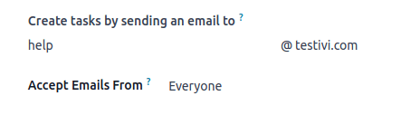

=============
Task creation
=============

Several ways of creating tasks are possible in Odoo, from manual, to more automated solutions, for
example creating tasks from emails or website forms.

Manual task creation
====================

Open the Project app and choose the desired project. Create a new task by doing one of the
following:

 - Pressing the :guilabel:`New` button in the upper left corner. This creates a new task in the
   first stage of your Kanban view.
 - Pressing the **plus** button next to the Kanban stage name. This creates a new task in this
   Kanban stage.

Fill in the :guilabel:`Task Title` and add one or more :guilabel:`Assignee`, then press
:guilabel:`Add`.

.. tip::
   The following fields can also be edited directly from the Kanban view without opening the
   individual task: :guilabel:`priority`, :guilabel:`allocated hours`, :guilabel:`assignees`,
   :guilabel:`task status`, :guilabel:`cover image`. You can also **color code** your tasks.

.. tip::
   You can use the following keyboard shortcuts in the task title to configure new tasks (modify the
   values in the examples below according to your needs):

   - **30h**: to allocate 30 hours to the task.
   - **#tags**: to add tags to the task.
   - **@user**: to assign the task to a user.
   - **!**: to star the task as high priority.

   Use the right format and order, as demonstrated in the screenshot below. The task at the top of
   the screen demonstrates the proper order of shortcuts. The task at the bottom demonstrates the
   results of typing: Prepare workshop 5h #school @Audrey! in the task title.

   .. image:: task_creation/task-shortcuts.png
      :alt: Using keyboard shortcuts to create a task in Project.

Creating tasks from an email alias
==================================

This feature allows for project tasks to be automatically created once an email is delivered to a
designated email address.

To configure it, open the Project app, then press the vertical elipsis next to the desired project's
name. Select :guilabel:`Settings`, then open the :guilabel:`Settings` tab.

Fill in the :guilabel:`Create tasks by sending an email to` as follows:

- **Section of the alias before the @ symbol**: type the name of the email alias, e.g. ‘contact,’
  ‘help,’ ‘jobs.’
- **Domain**: in most cases, this is filled in by default with your odoo.com domain. See more in
  :doc:`email configuration <../../../general/email_communication/email_servers>` documentation.
- **Accept Emails From**: refine the senders whose emails will create tasks in the project.

Once configured, the email alias can be seen under the name of your project on the Kanban dashboard.

When an email is sent to the alias, the email is automatically converted into a project task. The
following rules apply:

- Email sender is displayed in the :guilabel:`Customer` field.
- Email subject is displayed in the :guilabel:`Task Title` field.
- Email body is displayed in the :guilabel:`Description` field.
- The whole content of the email is additionally displayed in the **chatter**.
- All the recipients of the email (To/Cc/Bcc) are automatically added as **followers** of the task.

Creating tasks from a website form
==================================

If you have the Website module installed in your database, you can configure any form on your
website to trigger the creation of tasks in a project.

- Go to the website page where you wish to add the form.
- Click :guilabel:`Edit` in the top right corner to open the website editor.
- Navigate to the :guilabel:`Blocks` tab, then scroll down to :guilabel:`Dynamic content`.
- Drag and drop :guilabel:`Form block`, then click anywhere on the form to edit it.
- Edit the following fields in the form website editor:

  - :guilabel:`Action`: select :guilabel:`Create a Task`.
  - :guilabel:`Project`: choose the project that you want the new tasks to be created in.

When the form is submitted, it automatically creates a project task. Task's contents are defined by
the form's corresponding fields.

.. seealso::
   :doc:`Dynamic website content <../../../websites/website/web_design/building_blocks/dynamic_content>`
